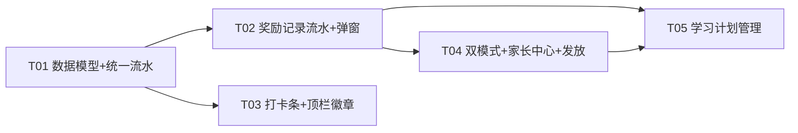

# 得乐学苑 v3 改造 · 增量设计文档

| 项 | 内容 |
|---|---|
| 文档版本 | v1.0（增量设计，与 PRD v1.0 对应） |
| 架构师 | 高见远（Gao） |
| 日期 | 2025-08-19 |
| 适用文件 | `src/pages/kidWorkspacePage.js`（1727 行，已全量通读核实） |
| 配套脚本 | `scripts/kid-wb-smoke-main.js`（37 项断言）、`scripts/kid-wb-export-html.js`（独立预览） |
| 上游输入 | `docs/kid-workspace-v3-PRD.md`（许清楚，v1.0） |
| 下游输出 | 工程师逐任务实施（任务列表见 §6） |

> 原则（全篇红线）：**只增不改**——新增字段/类名/选择器全部可选、缺省即现状行为；**不删除、不改名**现有字段、类名、`data-act`/`data-set`/`data-plan` 等选择器与文案；现有 37 项冒烟断言必须保持通过（清单见 §7.1）。所有行号以当前代码为准（已核实），供工程师定位，实施后如有行号漂移以函数名为准。

---

## 0. 术语与现状速览

- **S**：`localStorage` 键 `wb_kid_state_v1`（`LS_KEY`@660）下的状态对象，由 `emptyState()`@665 定义、`loadState()`@689 加载、`persist()`@708 落盘。
- **三大 Tab**：`today` 今日挑战 / `plan` 学习计划 / `reward` 成长奖励，`activeTab`@662 切换，`switchTab()`@970。
- **家长模式现状**：`S.parentMode` 布尔；顶栏 `[data-act="parent"]` 按钮（@874）；密码门禁 `enterParentGate()`@1518 + `openPwdModal()`@1543；家长专属操作 = 任务卡「✕ 移除/↺ 撤销(家长)」（`renderTaskCard`@1031-1033）、商城「管理道具」（`openShopManageModal`@1459）。
- **奖励规则现状**：`rewardFor(stars)`@753 = `taskBase(10, mult) + stars * taskBase(5, mult)`，`taskBase(rev, mult)`@752 = `Math.round(rev*mult*2)/2`；1/2/3 星 = 15/20/25（全局 ×1）。
- **CSS**：单模板字符串 `const CSS = \`...\``，结束于 @443；新增样式必须插在 @443 反引号**之前**，且**不得包含反引号**（预览脚本 @17 用 `const CSS = \`([\s\S]*?)\`;` 正则提取，见 §7.3）。

---

## 1. 架构方案概述

### 1.1 双模式状态机（student ↔ parent）

```
                        ┌──────────────────────────────┐
                        │        模式状态机             │
                        │  state = S.parentMode         │
                        │  view  = parentView(会话级)    │
                        └──────────────────────────────┘

  [学生模式]  S.parentMode=false, parentView='main'
     │ 点击顶栏 [data-act="parent"] → enterParentGate()
     │   首次: openPwdModal('设置家长模式密码') → S.parentPwd=pwd
     │   已有: openPwdModal('输入家长密码') → 校验 pwd===S.parentPwd
     ▼
  [家长模式]  S.parentMode=true, parentView='main'   ← 进入后仍停留在原 Tab 主视图(冒烟红线:撤销任务流程依赖主视图)
     │ 点击 [data-act="parent"] 再次 → S.parentMode=false → 回学生模式
     │ 点击 [data-act="parent-center"] → openParentCenter() → parentView='center'
     ▼
  [家长中心]  parentView='center'  ← 独立全屏视图,顶部返回按钮 data-pc="back" 回 parentView='main'
```

- **持久化**：只持久化 `S.parentMode`（现有字段，语义不变）；`parentView` 为模块级变量（`let parentView='main'`，@662 附近声明），**不持久化**，每次进入工具在 `renderKidWorkspaceTool`@836 重置为 `'main'`；`render()` 内防御性兜底 `if(!S.parentMode) parentView='main'`。
- **渲染根类**：`render()`@844-857 中 `rootEl.className = 'kid-wb theme-' + (S.themeMode||'project') + (S.parentMode ? ' parent-mode' : '')`。`parent-mode` 类 = P0-1 验收可测标识，CSS 追加金色系顶部底色（轻量、不覆盖主题变量，见 §5.3）。
- **视图分支**：`S.parentMode && parentView==='center'` 时只渲染 `renderTopbar()` + `renderParentCenter()`（隐藏 `renderToday()`/`renderTabs()`/Tab 内容）；否则维持现状三段结构。**Tab 栏与「今天要处理」在家长中心视图下不渲染**，避免与中心内计划管理重复。

### 1.2 家长中心如何复用现有组件体系

家长中心**不新建框架组件**，全部复用现有 CSS 类与弹层模式：

| 复用体系 | 现有类/函数 | 家长中心用途 |
|---|---|---|
| 卡片 | `.kid-card` / `.kid-card-title` | 计划管理、奖励发放、奖励记录、修改日志四个区块 |
| 计划布局 | `.kid-plan-days` / `.kid-plan-day` / `.kid-plan-item` / `.k-pi-dot` / `.k-pi-text` / `.kid-addtask` | 7 天计划管理列表（冒烟断言 `.kid-plan-day`==7、`.kid-plan-item`>=20 依赖此类名，**不得改名**） |
| 弹窗 | `.kid-overlay` / `.kid-modal` / `.kid-modal-head` / `.kid-modal-x` / `.kid-modal-actions` | 奖励记录弹窗、家长发放表单弹窗、计划项编辑弹窗 |
| 抽屉 | `.kid-drawer`（如需要） | 预留：移动端家长中心可演进为抽屉（本次不做） |
| 工具 | `toast()` / `confirmDialog()`（`../dialogs.js`@11） | 二次确认（奖励下调、删除守卫）、成功/失败提示 |
| 徽章 | `.kid-btn.gold` / `.k-badge` | 顶栏「家长中心」入口、来源标签 |

新增少量**纯增量** CSS 类（`.kid-pc-*`、`.kid-streak-strip`、`.k-ss-*`、`.kid-top-mini`、`.k-pi-mult`、`.kid-plan-log`、`.k-pl-*`），全部追加在 CSS 模板 @443 之前，不影响任何现有选择器。

---

## 2. 数据模型增量

### 2.1 S 新增字段（全部可选，缺省=现状行为）

| 字段 | 位置 | 类型 | 默认值 | 含义 |
|---|---|---|---|---|
| `rewardLog` | S 顶层（`emptyState`@683 `claimLog` 之后新增） | `RewardLogEntry[]` | `[]` | 统一奖励记录流水（任务/里程碑/家长发放/道具兑换） |
| `planLog` | S 顶层 | `PlanLogEntry[]` | `[]` | 家长修改日志（仅「发布更新」追加，环形保留最近 50 条） |
| `rewardMult` | `plan.weekly[].items[]` 计划项 | `number` | `1`（缺省=无配置，行为同现状） | 逐任务奖励倍率，范围 0.5~3，step 0.1，与全局 `S.rewardMult` 相乘叠加 |

> 计划项**不新增** `due`/生效日期等 P2 字段（本次不做，见 PRD §8 Q6/Q2，设计预留 `meta` 扩展位）。

### 2.2 rewardLog 条目结构

```js
{
  id: 'rl...',            // uid('rl'), 由 appendRewardLog 生成
  at: 1752900000000,      // number, Date.now()(数值时间戳,与 fmtCn 兼容)
  type: 'coin'|'diamond'|'crown'|'medal'|'item',
  amount: number,         // 获得为正数;道具兑换记录「花费金额」= -cost(负值表示支出,绝对值=花费)
  itemName: string,       // 获得项目名:任务名 / 道具名 / 奖章名 / 里程碑名(如「连胜里程碑」)
  project: string,        // 展示用获得项目,如「完成跳绳训练」「解锁奖章「三天连胜」」「家长发放」
  reason: string,         // 原因/备注,如「3星」「道具兑换」「学习进步」
  source: 'task'|'milestone'|'parent'|'shop',
  meta: object|null,      // 可选扩展:{stars, planItemId, taskId} / {cur, cost, migrated} / {streak} / {medalId}
}
```

各来源写入约定（**统一走 `appendRewardLog()`，禁止散写**）：

| source | type | amount | itemName | project | reason | meta |
|---|---|---|---|---|---|---|
| task | coin | `+r.coins`（经验同值但只记一条，经验不进流水，见 §4 备注） | 任务标题 | `完成${任务标题}` | `${stars}星` | `{stars, planItemId, taskId}` |
| milestone（连胜钻石） | diamond | `+5` | `连胜里程碑` | `连续打卡 ${streak} 天` | `连胜钻石奖励` | `{streak}` |
| milestone（周皇冠） | crown | `+1` | `周计划全勤皇冠` | `本周计划全部完成` | `周皇冠奖励` | — |
| milestone（奖章） | medal | `+1` | 奖章名 | `解锁奖章「${奖章名}」` | `奖章解锁` | `{medalId}` |
| parent | coin/diamond | `+amount` | 原因（必填项） | `家长发放` | 备注（选填） | `{note}` |
| shop | item | `-cost` | 道具名 | `兑换「${道具名}」` | `道具兑换` | `{cur, cost}` |

### 2.3 planLog 条目结构

```js
{
  id: 'pl...',            // uid('pl')
  at: 1752900000000,      // number, Date.now()
  summary: '周一:跳绳训练 目标 20→30,倍率 ×1→×1.5;周二:新增 口算练习',  // 变更摘要,多条目用 '; ' 连接
  detail: [               // 可选,结构化变更(供未来导出/分析)
    { day: 1, dayName: '周一', itemId: 'tpl-mon-1', title: '跳绳训练',
      changes: [{ field: 'target', before: '20', after: '30' }, { field: 'rewardMult', before: 1, after: 1.5 }] }
  ]
}
```

环形保留：`S.planLog.unshift(entry); if (S.planLog.length > 50) S.planLog.length = 50;`（最近 50 条，PRD 裁决 Q9）。

### 2.4 loadState() 迁移逻辑（方案 A，已裁决）

新增共享函数 `normalizeState(d)`（loadState/importData 复用，避免两处重复守卫）：

```js
function normalizeState(d) {
  const base = emptyState();
  const s = Object.assign(base, d);                     // 结构合并,天然向后兼容
  if (!Array.isArray(s.plan.weekly) || s.plan.weekly.length !== 7) s.plan.weekly = JSON.parse(JSON.stringify(TEMPLATE_PLAN));
  if (!Array.isArray(s.shop)) s.shop = JSON.parse(JSON.stringify(DEFAULT_SHOP));
  if (!s.medals) s.medals = {};
  if (!Array.isArray(s.claimLog)) s.claimLog = [];
  if (!Array.isArray(s.rewardLog)) s.rewardLog = [];    // 新增守卫
  if (!Array.isArray(s.planLog)) s.planLog = [];        // 新增守卫
  return s;
}
```

`loadState()`@689-706 改为：`S = normalizeState(JSON.parse(raw)); migrateClaimLog();`（catch 分支不变）。`importData()`@1692-1697 的 onOk 同样改为 `S = normalizeState(data); migrateClaimLog();`。

**claimLog → rewardLog 迁移（幂等）**：

```js
function migrateClaimLog() {
  // 幂等条件(方案A):仅当 rewardLog 为空且 claimLog 非空时迁移一次;迁移后 rewardLog 非空,再次进入自动跳过
  if (!Array.isArray(S.rewardLog) || S.rewardLog.length > 0) return;
  if (!Array.isArray(S.claimLog) || !S.claimLog.length) return;
  const migrated = S.claimLog.map((c) => ({
    id: uid('rl'), at: c.at || Date.now(),
    type: 'item', amount: -(Number(c.cost) || 0),
    itemName: c.name || '道具', project: `兑换「${c.name || '道具'}」`, reason: '道具兑换',
    source: 'shop', meta: { cur: c.cur, cost: c.cost, migrated: true },
  }));
  S.rewardLog = migrated.concat(S.rewardLog);           // claimLog 保留不删(防旧版本回退破坏)
}
```

- **幂等性**：条件天然保证只跑一次；`claimLog` 不删除，旧版本回退后仍可读。
- **边界**：若老用户首次进入即完成一个任务（先写 `rewardLog`）后再开奖励记录，旧 `claimLog` 将不迁移——因 `loadState` 在任务前执行，实际首次进入即迁移，风险极低（QA 用例见 §7.2-③）。
- **不迁移项**：仅迁移「道具兑换」为 `source=shop`；老数据无任务/里程碑流水，属正常（历史不可回溯）。

### 2.5 exportData / importData 兼容

- `exportData()`@1665：`JSON.stringify(payload)` 序列化整个 `S` → 新字段 `rewardLog`/`planLog`/计划项 `rewardMult` **自动包含**，无需改动（冒烟只校验 `v===1`/`tasks`/`parentMode`，见 §7.1-37）。
- `importData()`@1683：改走 `normalizeState` + `migrateClaimLog`（§2.4），老备份文件（无新字段）导入自动补齐；新备份（含新字段）导入到旧版本预览页时，预览脚本只做字符串级提取、忽略未知字段（§7.3）。
- **预览脚本兼容点**：`kid-wb-export-html.js` 不改；实施后必须重跑 `node scripts/kid-wb-export-html.js` 生成 `docs/kid-workspace-preview.html` 并打开验证不崩（新增代码不得引入 `import`/`export` 行、不得在 CSS 模板内使用反引号）。

---

## 3. 函数级设计

### 3.1 新增函数总表

| 函数 | 签名 | 职责 | 建议位置（就近插入） |
|---|---|---|---|
| `normalizeState` | `normalizeState(d) → S` | 结构合并 + 数组守卫 + 默认值（§2.4），loadState/importData 复用 | @706 之后 |
| `migrateClaimLog` | `migrateClaimLog() → void` | claimLog→rewardLog 幂等迁移（§2.4） | @706 之后 |
| `appendRewardLog` | `appendRewardLog(entry) → rec` | **统一流水写入唯一入口**（§4），unshift + 上限 500 防膨胀 | @756 附近（rewardFor 之后） |
| `findPlanItem` | `findPlanItem(planItemId) → item\|null` | 按 id 查 `plan.weekly[].items[]`（返回含 `rewardMult`） | @750 附近 |
| `renderStreakStrip` | `renderStreakStrip() → htmlString` | 近 7 天打卡条 + 连胜里程碑文案（P0-2，§5.2） | @944 之后 |
| `openRewardLog` | `openRewardLog() → void` | 奖励记录弹窗（类型/来源筛选 chips + 列表，P0-3） | @1456 之后（openClaimLog 旁） |
| `openParentCenter` | `openParentCenter() → void` | `parentView='center'; capturePlanSnapshot(); render();` | @1541 之后 |
| `renderParentCenter` | `renderParentCenter() → Element` | 家长中心主容器（§5.1），包含 4 区块 + 返回按钮，事件委托 | @1541 之后 |
| `renderPlanManage` | `renderPlanManage() → Element` | 计划管理卡：7 天列表（名称/目标/倍率/编辑/删除）+「＋添加」「📋 发布更新」 | @1291 之后 |
| `renderPlanLog` | `renderPlanLog() → Element` | 修改日志卡（只读列表，时间 + 摘要） | @1291 之后 |
| `capturePlanSnapshot` | `capturePlanSnapshot() → void` | 记录当前 `JSON.stringify(S.plan.weekly)` 到模块级 `_planSnapshot` | @1291 之后 |
| `diffPlan` | `diffPlan() → diff[]` | 对比快照与当前计划，产出结构化差异 | @1291 之后 |
| `publishPlan` | `publishPlan() → void` | 「发布更新」：diff→摘要→`planLog` 写入（cap 50）→ 更新快照 → persist/render/toast | @1291 之后 |
| `planChangeSummary` | `planChangeSummary(diff) → string` | 单条 diff 转摘要文案（PRD 示例格式） | @1291 之后 |
| `deletePlanItemGuard` | `deletePlanItemGuard(day, itemId) → boolean` | 删除守卫：今日已完成阻止；今日未完成允许+提示（§3.3.3） | @1291 之后 |
| `openParentGrantModal` | `openParentGrantModal() → void` | 家长发放表单弹窗（类型/数量/原因必填/备注≤200，P1） | @1515 之后 |
| `grantParentReward` | `grantParentReward(type, amount, reason, note) → boolean` | 校验 + 加余额 + `appendRewardLog(source='parent')` + persist/render/toast（§3.3.4） | @1515 之后 |

> 模块级新增变量：`let parentView='main'`（@662 附近）；`let _planSnapshot=null`（@662 附近）。

### 3.2 现有函数改动点（逐函数）

| 函数（行号） | 改动类型 | 具体改动 |
|---|---|---|
| `emptyState()` @665-687 | 改 | @683 `claimLog: []` 后新增两行：`rewardLog: [], planLog: [],` |
| `loadState()` @689-706 | 改 | 主体改为 `S = normalizeState(d); migrateClaimLog();`（@696 的 `Object.assign` 与 @697-700 守卫收敛进 `normalizeState`；@700 后追加迁移调用） |
| `importData()` @1683-1727 | 改 | @1692-1697 的 onOk 内 5 行守卫改为 `S = normalizeState(data); migrateClaimLog(); persist(); render(); toast(...)` |
| `rewardFor(stars)` @753-756 | 改 | 签名扩为 `rewardFor(stars, task)`；`task` 缺省 `null` 时行为与现状**完全一致**；叠加逐任务倍率（公式见 §4）。**所有调用点必须同步传 task**：`renderTaskCard`@1024、`openStarModal`@1070（r3/r2/r1）、`undoTask`@820 |
| `grantReward(task, stars)` @758-805 | 改 | ①@765-766 后（任务奖励结算处）`appendRewardLog({type:'coin', amount:r.coins, itemName:task.title, project:'完成'+task.title, reason:stars+'星', source:'task', meta:{stars, planItemId:task.planItemId, taskId:task.id}})`；②@775-779 连胜钻石分支内追加 `source='milestone'` diamond 记录；③@798-801 周皇冠分支内追加 `source='milestone'` crown 记录。连胜/四连/皇冠判定逻辑**不改** |
| `checkMedals()` @807-815 | 改 | @810-811 解锁分支内追加 `appendRewardLog({type:'medal', amount:1, itemName:m.name, project:'解锁奖章「'+m.name+'」', reason:'奖章解锁', source:'milestone', meta:{medalId:m.id}})` |
| `undoTask(id)` @817-828 | 改 | ①@820 改 `rewardFor(t.stars || 3, t)`（退回额与发放额一致，含任务倍率）；②建议追加：删除对应 `source='task'` 且 `meta.taskId===id` 的最近一条 rewardLog（保持流水与余额一致；里程碑/奖章记录不回退，与现有 `checkMedals()` 不回退语义一致） |
| `render()` @844-857 | 改 | ①@846 根类追加 `(S.parentMode ? ' parent-mode' : '')`；②@846 后追加 `if(!S.parentMode) parentView='main';`；③@848-856 改双分支：`S.parentMode && parentView==='center'` 时 `rootEl.appendChild(renderParentCenter())`，否则现状三段结构 |
| `renderTopbar()` @860-887 | 改 | ①@874 家长按钮不动（冒烟红线：文案含「家长」）；②@874 后新增家长中心入口：`${S.parentMode ? '<button class="kid-btn sm gold" data-act="parent-center" title="进入家长中心">🏠 家长中心</button>' : ''}`；③@871-875 的 `kid-top-actions` 内新增 P2-6 迷你徽章：`<span class="kid-top-mini" title="金币">${coinSvg(14)} ${S.coins}</span><span class="kid-top-mini" title="钻石">${diamondSvg(14)} ${S.diamonds}</span>`；④@877-885 事件处理追加 `else if (act === 'parent-center') openParentCenter();` |
| `renderToday()` @890-944 | 改 | @935（`kid-today-list` 之前）插入 `${renderStreakStrip()}`（P0-2 打卡条）；其余（进度环/连胜文案/逾期列表）不动 |
| `renderTaskCard(t)` @1011-1063 | 改 | @1024 `rewardFor(t.stars || 3)` → `rewardFor(t.stars || 3, t)`（奖励预览与实发一致）；其余不动（`[data-act="start/finish/reset/del/undo"]` 全部保留） |
| `openStarModal(taskId)` @1066-1117 | 改 | @1070 `rewardFor(3/2/1)` → `rewardFor(3/2/1, t)`（预览一致）；`[data-star]`/`[data-confirm]` 不动 |
| `renderPlanTab()` @1183-1252 | 改 | ①@1227 计划项 map 内：家长模式（`S.parentMode`）时在 `.k-pi-text` 后追加 `<span class="k-pi-mult">×${fmtMult(it.rewardMult)}</span>` 与编辑按钮 `<button class="k-pi-x" data-edit="${d}:${it.id}" title="编辑">✎</button>`（保留 `.kid-plan-item`/`.k-pi-text`/`data-del` 结构与类名，冒烟计数不受影响）；②@1242-1246 删除分支：`S.parentMode` 时走 `deletePlanItemGuard(day, itemId)`，否则维持现状 splice（**学生编辑能力保留**，PRD 裁决 Q4）；③@1247-1249 添加分支不动；④新增 `data-edit` 分支 → `openPlanItemModal(day, item)` |
| `openPlanItemModal(day)` @1254-1291 | 改 | 签名扩为 `openPlanItemModal(day, item)`（`item` 缺省=添加模式，现调用 @1248 不受影响）：①@1261 标题按模式：「添加计划任务」/「编辑计划任务」；②@1267 后新增倍率字段 `<div class="kid-field"><label class="kid-label">奖励倍率</label><input type="number" data-in="mult" min="0.5" max="3" step="0.1" value="1"></div>`，**仅 `S.parentMode` 渲染**（倍率配置家长专属，学生 Tab 添加不显示）；③@1277-1287 保存分支：`item` 存在 → 更新字段（cat/title/target/rewardMult），若新倍率 < 旧倍率先 `confirmDialog` 二次确认；`item` 缺省 → push `{id:uid('tp'), cat, title, target, rewardMult:1}` |
| `renderRewardTab()` @1294-1419 | 改 | ①@1351 商城头「兑换记录」按钮文案改为「🎁 奖励记录」（**保留 `data-shop="log"` 属性**，冒烟未断言该文案，安全）；②@1377 事件 `else if (log) openClaimLog();` → `else if (log) openRewardLog();`；③（可选）@1329 连胜文案下方复用 `renderStreakStrip()`；钱包/数字人/头像/商城/奖章结构**不动**（`.kid-wallet-card`==4、`.kid-medal`==11 等红线） |
| `claimItem(id)` @1422-1439 | 改 | @1433 `claimLog.unshift` **保留（双写）**；其后追加 `appendRewardLog({type:'item', amount: -it.cost, itemName: it.name, project:'兑换「'+it.name+'」', reason:'道具兑换', source:'shop', meta:{cur:it.cur, cost:it.cost}})`；`[data-claim]`/「确认兑换」文案不动 |
| `enterParentGate()` @1518-1541 | 改（极小） | 逻辑不变（首设/校验/退出）；仅在成功进入家长模式回调内（@1527、@1535）追加 `parentView='main';`（防御性） |
| `openSettings()` @1577-1662 | 改（极小） | @1644-1647 家长开关关闭分支追加 `parentView='main';`；其余不动 |
| `openClaimLog()` @1441-1456 | 不改 | 保留（可能不再被入口调用，但不得删除，防外部引用） |
| `exportData()` @1665-1681 | 不改 | 新字段自动随 `S` 导出 |
| `rollover()` @724-747 / `seedSample()` @713-721 / `renderTabs()` / `switchTab()` / `openPwdModal()` / `openShopManageModal()` / `confetti()` | 不改 | 无涉 |

### 3.3 关键算法伪码

#### 3.3.1 rewardFor 叠加公式（§4 详述）

```js
function rewardFor(stars, task) {
  const g = S.rewardMult || 1;                       // 全局倍率(现状)
  const item = task && task.planItemId ? findPlanItem(task.planItemId) : null;
  const im = item && item.rewardMult ? item.rewardMult : 1;   // 任务倍率,缺省 1
  const m = g * im;                                  // 相乘叠加(PRD 裁决 Q1)
  const coins = Math.round((taskBase(10, m) + stars * taskBase(5, m)) * 10) / 10;  // 保留 1 位小数
  return { coins, exp: coins };                      // 金币/经验同值(现状语义)
}
// task 缺省(null)时 im=1 → 与现状 rewardFor(stars) 完全一致,保证 undoTask/openStarModal 等调用无回归
```

#### 3.3.2 renderStreakStrip 推导

```js
function renderStreakStrip() {
  const lit = (S.streak > 0 && (S.lastDoneDate === todayStr() || S.lastDoneDate === ystr()))
    ? Math.min(S.streak, 7) : 0;
  const days = ['6天前','5天前','4天前','3天前','2天前','昨天','今天'];   // 展示用短标签
  const dots = days.map((label, i) => {
    const on = i >= 7 - lit;                          // 最近 lit 天点亮,今天在最右
    const cls = (i === 6 ? ' today' : '') + (on ? ' lit' : '');
    return `<span class="k-ss-day${cls}">${['一','二','三','四','五','六','今'][i]}</span>`;
  }).join('');
  let text;
  if (S.streak === 0) text = '今天完成 1 个任务,点亮连胜第一棒 🔥';
  else if (S.streak >= 30) text = `已连续打卡 ${S.streak} 天,已是满级连胜王 🏆`;
  else {
    const nextM = [3, 7, 14, 30].find((m) => m > S.streak);
    text = `已连续打卡 ${S.streak} 天 🔥 · 距 ${nextM} 天钻石奖励还差 ${nextM - S.streak} 天`;
  }
  if (S.lastDoneDate === todayStr()) text += ' · 今日已打卡 ✅';
  return `<div class="kid-streak-strip"><div class="k-ss-days">${dots}</div><div class="k-ss-text">${text}</div></div>`;
}
```

#### 3.3.3 deletePlanItemGuard

```js
function deletePlanItemGuard(day, itemId) {
  const t = S.tasks.find((x) => x.date === todayStr() && x.planItemId === itemId);
  if (t && t.done) { toast('今日已完成,明日可调整', 'warn'); return false; }  // 阻止
  const arr = S.plan.weekly[day].items;
  const idx = arr.findIndex((i) => i.id === itemId);
  if (idx >= 0) arr.splice(idx, 1);
  if (t) toast('今日已生成任务仍保留', 'ok');                                  // 未完成→允许删除+提示
  persist(); render();
  return true;
}
```

#### 3.3.4 grantParentReward

```js
function grantParentReward(type, amount, reason, note) {
  const amt = Number(amount);
  const max = type === 'diamond' ? 100 : 1000;           // 金币 1~1000,钻石 1~100(PRD 裁决 Q3)
  if (!Number.isFinite(amt) || amt < 1 || amt > max) { toast(`单次发放数量须在 1~${max} 之间`, 'warn'); return false; }
  const reasonTxt = (reason || '').trim();
  if (!reasonTxt) { toast('请选择或填写发放原因', 'warn'); return false; }
  if (type === 'coin') S.coins += amt; else S.diamonds += amt;
  appendRewardLog({ type, amount: amt, itemName: reasonTxt, project: '家长发放', reason: (note || '').trim(), source: 'parent', meta: { note: (note || '').trim() } });
  persist(); render();
  toast(`已发放 ${amt} ${type === 'coin' ? '金币' : '钻石'} 🎁`, 'ok');
  return true;
}
```

#### 3.3.5 publishPlan（发布更新 = 保存已即时生效 + 记日志）

```js
function publishPlan() {
  const diffs = diffPlan();                             // 对比 _planSnapshot 与 S.plan.weekly
  if (!diffs.length) { toast('没有需要发布的修改', 'ok'); return; }
  const summary = diffs.map(planChangeSummary).join('; ');
  S.planLog.unshift({ id: uid('pl'), at: Date.now(), summary, detail: diffs });
  if (S.planLog.length > 50) S.planLog.length = 50;
  capturePlanSnapshot();
  persist(); render();
  toast('已发布更新,学生端立即生效 📋', 'ok');
}
```
- 计划项编辑在弹窗保存时**立即写入 S 并 persist**（本地单机「保存即生效」，PRD 裁决 Q7）；「发布更新」仅负责**生成修改日志**并刷新快照基线。`_planSnapshot` 在 `openParentCenter()` 与每次 `publishPlan()` 后更新。

---

## 4. 奖励计算规则

### 4.1 精确公式

```
完成某任务获得奖励 = rewardFor(stars, task)

rewardFor(stars, task) =
  m      = S.rewardMult(全局,默认1) × task.rewardMult(计划项倍率,0.5~3,缺省1)
  base   = round2(10 × m)          // round2(x) = Math.round(x*2)/2  (taskBase@752 保留)
  star   = round2(5  × m)
  coins  = round(base + stars × star, 1)   // 四舍五入保留 1 位小数
  exp    = coins(与现状一致,金币/经验同值)
```

示例（全局 ×1.5 + 任务 ×2）：m=3 → base=30，star=15 → 3 星 = 30+45=75。1/2/3 星对应完成质量分级（3 星≈优秀/2 星≈良好/1 星≈及格，星级倍率维持现状不变）。

- **不改**：`taskBase()`@752 保持原实现（0.5 粒度 = 1 位小数），仅在其外层补 `Math.round(…*10)/10` 确保 1 位小数显示（如 29.5）。
- **兼容**：`task` 缺省或 `planItemId` 未命中计划项 → `task.rewardMult` 视为 1，公式退化为现状 `rewardFor(stars)`，**零回归**。
- 展示层同步：`renderTaskCard`@1024（完成卡奖励）、`openStarModal`@1070（星级预览）、`undoTask`@820（撤销退回额）三处调用点统一传 `task`，保证「预览 = 实发 = 可退回」。

### 4.2 统一流水入口 appendRewardLog

```js
function appendRewardLog(entry) {
  const rec = Object.assign(
    { id: uid('rl'), at: Date.now(), type: 'coin', amount: 0, itemName: '', project: '', reason: '', source: 'task', meta: null },
    entry
  );
  S.rewardLog.unshift(rec);
  if (S.rewardLog.length > 500) S.rewardLog.length = 500;   // 上限防膨胀(可选,不影响功能)
  return rec;
}
```

四种写流水路径**全部收敛到该函数**：

| 路径 | 调用点 | 写入 |
|---|---|---|
| 任务完成 | `grantReward`@758（任务奖励分支） | source=task |
| 里程碑 | `grantReward`@758（连胜钻石/周皇冠分支）+ `checkMedals`@807（奖章） | source=milestone |
| 道具兑换 | `claimItem`@1422（`claimLog` 双写之后） | source=shop |
| 家长发放 | `grantParentReward` | source=parent |

> 经验值（exp）不进流水：PRD 列表字段为「获得时间/奖励类型/数量/获得项目/原因/来源」，金币/经验同值发放，记一条 `type='coin'` 即可（如需区分可在 `meta.exp` 存经验值，本次不展示）。

---

## 5. UI 结构设计

### 5.1 家长中心 DOM 骨架（renderParentCenter 输出）

```html
<div class="kid-parent-center">
  <!-- 顶部:返回 + 标题 -->
  <div class="kid-pc-head">
    <button class="kid-btn sm" data-pc="back">← 返回学生视图</button>
    <span class="kid-pc-title">👨‍👩‍👦 家长中心</span>
  </div>

  <!-- 区块 1+2:学习计划管理(含逐任务倍率配置) -->
  <div class="kid-card">
    <div class="kid-card-title">🗓️ 学习计划管理</div>
    <div class="kid-plan-days">          <!-- 复用 .kid-plan-days/.kid-plan-day,冒烟计数红线 -->
      <div class="kid-plan-day">
        <div class="kid-plan-day-head">
          <span class="kid-plan-day-name">周一 · 今天</span>
          <span class="k-pi-count">2/3</span>
        </div>
        <div class="kid-plan-item">
          <span class="k-pi-dot" style="background:#f59e0b"></span>
          <span class="k-pi-text">跳绳训练 · 20分钟</span>
          <span class="k-pi-mult">×1.5</span>
          <button class="k-pi-x" data-plan-edit="1:tpl-mon-1" title="编辑">✎</button>
          <button class="k-pi-x" data-plan-del="1:tpl-mon-1" title="删除">✕</button>
        </div>
        <div class="kid-plan-empty">空,点「＋」添加</div>
        <button class="kid-addtask" style="min-height:40px;font-size:12px" data-plan-add="1">＋ 添加</button>
      </div>
      <!-- ... 共 7 天 .kid-plan-day ... -->
    </div>
    <div class="kid-plan-tools">
      <button class="kid-btn primary" data-pc="publish">📋 发布更新</button>
    </div>
    <div class="kid-today-banner">💡 倍率叠加:奖励 = 基础 × 全局倍率 × 任务倍率(0.5~3),默认 ×1;当日已完成任务不可删除</div>
  </div>

  <!-- 区块 3:奖励发放 -->
  <div class="kid-card">
    <div class="kid-card-title">🎁 奖励发放</div>
    <button class="kid-btn gold" data-pc="grant">＋ 发放金币/钻石</button>
    <div class="kid-pc-hint">金币单次 1~1000,钻石单次 1~100,原因必填,备注选填(≤200 字)</div>
  </div>

  <!-- 区块 4:奖励记录 -->
  <div class="kid-card">
    <div class="kid-card-title">📜 奖励记录</div>
    <button class="kid-btn sm" data-pc="reward-log">查看全部记录</button>
    <div class="kid-pc-hint">含任务完成 / 里程碑 / 家长发放 / 道具兑换 全部流水</div>
  </div>

  <!-- 区块 5:修改日志 -->
  <div class="kid-card">
    <div class="kid-card-title">📝 修改日志(最近 50 条)</div>
    <div class="kid-plan-log">
      <div class="k-pl-item"><span class="k-pl-time">8月19日 周一</span><span class="k-pl-sum">周一:跳绳训练 目标 20→30,倍率 ×1→×1.5</span></div>
      <div class="kid-today-empty">暂无修改记录,编辑计划后点「发布更新」生成</div>
    </div>
  </div>
</div>
```

事件委托（挂在 `.kid-parent-center` 上）：
- `[data-pc="back"]` → `parentView='main'; render();`
- `[data-pc="publish"]` → `publishPlan();`
- `[data-pc="grant"]` → `openParentGrantModal();`
- `[data-pc="reward-log"]` → `openRewardLog();`
- `[data-plan-add]` → `openPlanItemModal(day);`
- `[data-plan-edit]` → 取 `day:itemId` → `openPlanItemModal(day, item);`
- `[data-plan-del]` → `deletePlanItemGuard(day, itemId);`

### 5.2 打卡条 DOM（renderStreakStrip 输出）

```html
<div class="kid-streak-strip">
  <div class="k-ss-days">
    <span class="k-ss-day" title="6天前">一</span>
    <span class="k-ss-day lit" title="昨天">六</span>
    <span class="k-ss-day today lit" title="今天">今</span>   <!-- 未打卡今天:today 无 lit;已打卡:today lit + 文案 ✅ -->
  </div>
  <div class="k-ss-text">已连续打卡 5 天 🔥 · 距 7 天钻石奖励还差 2 天 · 今日已打卡 ✅</div>
</div>
```
- 位置：`renderToday()` 的「今天要处理」标题行下方、`.kid-today-list` 之前（@935 插入）。
- 语义：最近 7 天从右到左 = 今天→6 天前；点亮规则见 §3.3.2；`streak=0` 显示引导文案；`streak>=30` 显示「已是满级连胜王」。

### 5.3 顶栏家长 badge / 迷你徽章

```html
<div class="kid-top-actions">
  <span class="kid-top-mini" title="金币">🪙 90</span>          <!-- P2-6 实时徽章(本次纳入) -->
  <span class="kid-top-mini" title="钻石">💎 0</span>
  <button class="kid-btn sm" data-act="export" ...>⬇ 导出</button>
  <button class="kid-btn sm" data-act="import" ...>⬆ 导入</button>
  <button class="kid-btn sm gold" data-act="parent" ...>👨‍👩‍👦 家长</button>   <!-- 家长模式文案保留(冒烟红线) -->
  <button class="kid-btn sm gold" data-act="parent-center" ...>🏠 家长中心</button>  <!-- 仅家长模式渲染 -->
  <button class="kid-btn sm" data-act="settings" ...>⚙ 设置</button>
</div>
```
- 根容器：`<div class="kid-wb theme-xxx parent-mode">`（`parent-mode` 类即 P0-1 可测标识）。
- CSS 追加（@443 前）：`.kid-wb.parent-mode{--kbg-top:linear-gradient(...)}` 金色系顶部底色（轻量覆盖，不破坏主题变量）；`.kid-top-mini`、`.kid-pc-*`、`.kid-streak-strip/.k-ss-*`、`.k-pi-mult`、`.kid-plan-log/.k-pl-*` 均为新增类。

### 5.4 奖励记录弹窗（openRewardLog）

```html
<div class="kid-overlay"><div class="kid-modal" style="max-width:520px">
  <div class="kid-modal-head"><div class="kid-modal-title">📜 奖励记录</div><button class="kid-modal-x" data-close>✕</button></div>
  <div class="kid-rl-chips">
    <span class="kid-rl-chip on" data-rl-type="all">全部</span><span class="kid-rl-chip" data-rl-type="coin">金币</span>
    <span class="kid-rl-chip" data-rl-type="diamond">钻石</span><span class="kid-rl-chip" data-rl-type="crown">皇冠</span>
    <span class="kid-rl-chip" data-rl-type="medal">奖章</span><span class="kid-rl-chip" data-rl-type="item">道具</span>
    <span class="kid-rl-chip on" data-rl-source="all">全部来源</span><span class="kid-rl-chip" data-rl-source="task">任务完成</span>
    <span class="kid-rl-chip" data-rl-source="milestone">里程碑</span><span class="kid-rl-chip" data-rl-source="parent">家长发放</span>
    <span class="kid-rl-chip" data-rl-source="shop">道具兑换</span>
  </div>
  <div style="max-height:52vh;overflow:auto">
    <!-- 行:[类型图标] 项目名 · +N/-N [来源标签]  时间 -->
    <div class="kid-rl-row">
      <span class="k-rl-ico">🪙</span>
      <div class="k-rl-main"><div class="k-rl-name">完成跳绳训练 · +20 金币</div><div class="k-rl-sub">3星 · 8月19日 周一</div></div>
      <span class="k-rl-src task">任务完成</span>
    </div>
    <div class="kid-today-empty">还没有奖励记录,去完成今天的挑战吧 🎯</div>
  </div>
</div></div>
```
- 筛选：类型 chips（全部/金币/钻石/皇冠/奖章/道具）+ 来源 chips（全部/任务完成/里程碑/家长发放/道具兑换），模块内局部状态 `fType='all'`、`fSource='all'`；点 chip 切状态重渲染列表。
- 空态复用 `.kid-today-empty`，文案固定。

---

## 6. 任务列表（按实现顺序，含依赖与验收）

> 5 个任务 = 上限；每任务以「主改文件 + 回归脚本 + 生成产物」为单位，可独立实现与自测。行号以当前代码为准。

### T01 数据模型增量 + 统一流水工具（基础设施）

- **文件**：`src/pages/kidWorkspacePage.js`（`emptyState`@665-687、`loadState`@689-706、`importData`@1683-1727、CSS @443 前追加 `normalizeState`/`migrateClaimLog`/`appendRewardLog` 所需默认样式占位）、`scripts/kid-wb-smoke-main.js`（新增断言建议由 QA 落地，工程师只保证不破坏现有 37 项）、`docs/kid-workspace-preview.html`（重跑 `node scripts/kid-wb-export-html.js` 生成并验证不崩）
- **新增函数**：`normalizeState(d)`、`migrateClaimLog()`、`appendRewardLog(entry)`
- **改动点**：`emptyState` 加 `rewardLog:[]`/`planLog:[]`；`loadState` 收敛为 `normalizeState`+`migrateClaimLog`；`importData` 同样收敛
- **依赖**：无（首个任务）
- **优先级**：P0
- **验收断言建议**：
  1. 构造仅含旧字段的 localStorage（`wb_kid_state_v1`，无 `rewardLog`/`planLog`）→ 进入模块不报错，`S.rewardLog===[]`、`S.planLog===[]`
  2. 旧 `claimLog` 非空 → 进入后 `rewardLog` 出现 `source='shop', type='item', amount=-cost` 记录且 `claimLog` 原样保留；再次进入不重复迁移（幂等）
  3. `appendRewardLog` 写入后 `S.rewardLog[0].id` 以 `rl` 开头、`at` 为数值时间戳
  4. `node scripts/kid-wb-export-html.js` 成功生成预览，浏览器打开无 JS 报错
  5. 现有 37 项冒烟全过

### T02 统一奖励记录流水接入 + 奖励记录弹窗

- **文件**：`src/pages/kidWorkspacePage.js`（`rewardFor`@753-756、`grantReward`@758-805、`checkMedals`@807-815、`undoTask`@817-828、`renderTaskCard`@1011-1063、`openStarModal`@1066-1117、`claimItem`@1422-1439、`renderRewardTab`@1294-1419、新增 `openRewardLog`/`findPlanItem`）、`scripts/kid-wb-smoke-main.js`（QA 新增：任务后 rewardLog、兑换后双写）、`docs/kid-workspace-preview.html`（重生成验证）
- **新增函数**：`findPlanItem(planItemId)`、`openRewardLog()`
- **改动点**：`rewardFor(stars, task)` 签名扩展（此时所有计划项无 `rewardMult`，行为零变化）；`grantReward`/`checkMedals`/`claimItem` 接入 `appendRewardLog`；`undoTask`/`renderTaskCard`/`openStarModal` 三处调用点传 `task`；`renderRewardTab`@1351/1377 入口改「奖励记录」
- **依赖**：T01
- **优先级**：P0
- **验收断言建议**：
  1. 完成 1 个任务 → `rewardLog` 新增 `source='task'`，`project='完成'+任务名`，`amount` 与完成卡显示一致（金币/经验同值）
  2. 连胜 3 天 → 新增 `source='milestone'` diamond +5；周皇冠/奖章解锁同样有记录
  3. 兑换道具 → `rewardLog` 新增 `source='shop'`（`amount=-cost`）+ `claimLog` 仍写入（双写）；老 `claimLog` 迁移记录在列表可见
  4. 奖励记录弹窗按类型/来源筛选生效；空态文案正确
  5. 撤销任务 → 余额退回额与发放额一致（含倍率），对应 `source='task'` 记录被移除
  6. 现有 37 项冒烟全过（尤其「完成卡片显示金币+经验」「兑换后金币减少」「撤销后回到未完成」）

### T03 打卡条（P0-2）+ 顶栏实时徽章（P2-6）

- **文件**：`src/pages/kidWorkspacePage.js`（`renderToday`@890-944 接入、`renderTopbar`@860-887 迷你徽章、新增 `renderStreakStrip`、CSS @443 前追加 `.kid-streak-strip/.k-ss-*/.kid-top-mini`）、`scripts/kid-wb-smoke-main.js`（QA 新增：7 圆点/点亮+1/里程碑文案）、`docs/kid-workspace-preview.html`（重生成验证）
- **新增函数**：`renderStreakStrip()`
- **改动点**：`renderToday`@935 插入 `${renderStreakStrip()}`；`renderTopbar`@871-875 加金币/钻石迷你徽章（不影响 `.kid-wallet-card .k-w-num` 断言）；`renderRewardTab`@1329 可选复用
- **依赖**：T01（数据守卫）；无 T02 依赖，可并行
- **优先级**：P0
- **验收断言建议**：
  1. 今日区出现 `.kid-streak-strip` 且 `.k-ss-day` 数量 = 7
  2. `streak=0` 显示引导文案不报错；`lastDoneDate=昨天` 时点亮到昨天（今天灰显）
  3. 完成一次任务后 `streak+1`，点亮数同步 +1（无需刷新）
  4. `streak=5` 显示「距 7 天钻石奖励还差 2 天」；`streak>=30` 显示「已是满级连胜王」
  5. 顶栏出现 `.kid-top-mini` 金币/钻石，数值与钱包一致且实时
  6. 现有 37 项冒烟全过（今日进度环 `.kid-progress svg` 断言不受影响）

### T04 双模式切换 + 家长中心框架 + 家长发放（P0-1 + P1）

- **文件**：`src/pages/kidWorkspacePage.js`（`render`@844-857 双分支 + `parent-mode` 类、`renderTopbar`@860-887 家长中心入口 + `data-act="parent-center"`、`enterParentGate`@1518-1541、`openSettings`@1577-1662 退出兜底、新增 `parentView` 变量、`renderParentCenter`/`openParentCenter`/`openParentGrantModal`/`grantParentReward`、CSS @443 前追加 `.kid-wb.parent-mode/.kid-pc-*`）、`scripts/kid-wb-smoke-main.js`（QA 新增：parent-mode 类/家长中心入口/发放校验）、`docs/kid-workspace-preview.html`（重生成验证）
- **新增函数**：`renderParentCenter()`、`openParentCenter()`、`openParentGrantModal()`、`grantParentReward(type, amount, reason, note)`
- **改动点**：`render` 根类/视图分支；`renderTopbar` 新增入口与事件；`enterParentGate` 进入回调置 `parentView='main'`；`openSettings` 退出置 `parentView='main'`。**`openPwdModal`/`[data-act="parent"]` 流程不动（冒烟红线）**
- **依赖**：T01（`appendRewardLog` 供 parent 流水）、T02（家长中心「奖励记录」复用 `openRewardLog`）
- **优先级**：P0
- **验收断言建议**：
  1. 首次进入无 `parent-mode` 类、无「家长中心」入口；设密码进入家长模式后根容器含 `parent-mode` 类、顶栏出现「🏠 家长中心」按钮且文案含「家长」
  2. 点击家长中心 → 隐藏 Tab 栏与今日区，渲染 4 个区块（计划管理/奖励发放/奖励记录/修改日志）；「返回学生视图」回到主视图
  3. 密码错误不进入并提示（沿用现状）
  4. 家长发放：金币 1000 成功/1001 阻止提示；钻石 100 成功/101 阻止；原因空阻止；成功后余额增加且 `rewardLog` 新增 `source='parent'`，备注写入 `reason`/`meta.note`
  5. 退出家长模式（按钮或设置开关）→ 恢复学生视图，家长中心入口消失
  6. 现有 37 项冒烟全过（尤其家长密码/撤销流程）

### T05 学习计划管理（P0-4 家长中心核心）

- **文件**：`src/pages/kidWorkspacePage.js`（`openPlanItemModal`@1254-1291 扩展编辑+倍率、`renderPlanTab`@1183-1252 家长模式倍率标签/编辑/删除守卫、新增 `renderPlanManage`/`renderPlanLog`/`capturePlanSnapshot`/`diffPlan`/`publishPlan`/`planChangeSummary`/`deletePlanItemGuard`、CSS @443 前追加 `.k-pi-mult/.kid-plan-log/.k-pl-*`）、`scripts/kid-wb-smoke-main.js`（QA 新增：倍率计算/二次确认/删除守卫/planLog）、`docs/kid-workspace-preview.html`（重生成验证）
- **新增函数**：`renderPlanManage()`、`renderPlanLog()`、`capturePlanSnapshot()`、`diffPlan()`、`publishPlan()`、`planChangeSummary(diff)`、`deletePlanItemGuard(day, itemId)`
- **改动点**：`renderParentCenter` 区块 1/5 接入；`openPlanItemModal` 双模式（仅家长渲染倍率字段、编辑已有项、下调二次确认）；`renderPlanTab` 家长模式标签/编辑/守卫（学生能力保留）
- **依赖**：T02（`rewardFor(stars, task)` 已可叠加任务倍率）、T04（家长中心容器存在）
- **优先级**：P0
- **验收断言建议**：
  1. 家长中心计划管理 7 天列表齐全；编辑计划项倍率 ×1.5 → 发布更新 → 退出家长模式完成任务 → 奖励 = `rewardFor(stars) × 1.5`（与任务卡预览一致）
  2. 倍率从 ×2 下调到 ×1 → 出现二次确认；确认后才生效
  3. 删除「今日已完成」计划项 → 阻止并提示「今日已完成,明日可调整」；删除「今日未完成」计划项 → 允许并提示「今日已生成任务仍保留」
  4. 发布更新后 `planLog` 新增 1 条（摘要含「目标 20→30,倍率 ×1→×1.5」格式），仅保留最近 50 条
  5. 学生模式计划 Tab 无倍率字段/无编辑按钮，添加/删除能力与现状一致；计划项数量断言（≥20）保持
  6. 老计划无 `rewardMult` → 完成任务奖励与现状一致（×1）
  7. 现有 37 项冒烟全过（计划 7 天/条目/开关/今天高亮）

### 任务依赖图



---

## 7. 风险与兼容清单

### 7.1 冒烟 37 项断言红线清单（grep 自 `kid-wb-smoke-main.js`，以下选择器/文案**不得改名或移除**）

| # | 断言名 | 涉及选择器 / 文案 | 红线 |
|---|---|---|---|
| 1 | 侧栏找到得乐学苑节点 | 文本 `得乐学苑` | 保留 |
| 2 | 页面渲染 .kid-wb | `.kid-wb` | 根类不得改名 |
| 3 | 今日任务卡片≥4 | `.kid-task` | 保留 |
| 4 | 今天要处理列表 | `.kid-today-item` | 保留 |
| 5 | 逾期任务标红≥1 | `.kid-today-item.overdue` | 保留 |
| 6 | 标题含得乐学苑 | `.kid-title` 含 `得乐学苑` | 保留 |
| 7 | 开始挑战→started | `.kid-task:not(.done) [data-act="start"]`、`.kid-task.started` | 保留 |
| 8 | 星级验收弹窗 | `.kid-star-btn` | 保留 |
| 9 | 确认后任务完成 | `[data-confirm]`、`.kid-task.done` | 保留 |
| 10 | 完成卡片显示金币+经验 | `.kid-task.done` 文本含 `金币` 与 `经验` | 完成卡奖励文案保留（`+N 金币`/`+N 经验`） |
| 11 | 钱包 4 项 | `.kid-wallet-card` == 4 | **不得新增/删减钱包卡**（顶栏徽章用 `.kid-top-mini` 不冲突） |
| 12 | 数字人 SVG | `.kid-hero-box svg` | 保留 |
| 13 | 头像 8 个 | `.kid-avatar-item` == 8 | 保留 |
| 14 | 商城道具≥4 | `.kid-shop-item` | 保留 |
| 15 | 奖章墙 11 枚 | `.kid-medal` == 11 | **不得新增奖章卡** |
| 16 | 等级称号 | `.kid-lv-title` 匹配 `/Lv\.\d/` | 保留 |
| 17 | 兑换确认弹窗 | `[data-claim]`、按钮文本 `确认兑换` | 保留 |
| 18 | 兑换后金币减少 | `.kid-wallet-card .k-w-num` 数值 | 保留 |
| 19 | 计划 7 天 | `.kid-plan-day` == 7 | 保留 |
| 20 | 计划任务条目≥20 | `.kid-plan-item` | 倍率/编辑按钮须内嵌于 `.kid-plan-item` 内，不改变计数 |
| 21 | 计划开关 | `[data-plan="toggle"]` | 保留 |
| 22 | 今天高亮 | `.kid-plan-day.today` | 保留 |
| 23 | 家长密码弹窗 | `[data-act="parent"]`、`.kid-pwd-key` | 门禁流程不动 |
| 24 | 设置后家长模式开启 | `[data-act="parent"]` 文本含 `家长` | 按钮文案保留 |
| 25 | 家长模式显示撤销按钮 | `[data-act="undo"]` | 保留 |
| 26 | 撤销后回到未完成 | 按钮文本 `确认撤销`、`.kid-task.done` == 0 | 保留 |
| 27-31 | 主题切换 class | `[data-act="settings"]`、`[data-set="theme"]`、`.kid-wb.theme-dark/.theme-candy/.theme-space/.theme-project` | 保留（根类拼接需保持 `theme-` 前缀） |
| 32 | 星际探险星空背景 | `.kid-wb` computed backgroundImage 含 `radial-gradient` | 保留（`parent-mode` 覆盖仅改 `--kbg-top`，不得移除 space 背景规则） |
| 33 | 顶栏等级徽章 | `.kid-lv-pill` | 保留 |
| 34 | 今日完成率进度环 | `.kid-progress svg` | 保留 |
| 35 | 抽屉可关闭 | `.kid-drawer`、`.kid-drawer [data-close]` | 保留 |
| 36 | 导出按钮 | `[data-act]` 文本含 `导出` | 保留 |
| 37 | localStorage 持久化 | `wb_kid_state_v1`、`v===1`、`tasks>=4`、`parentMode===true` | 键名/版本号/字段语义不动 |

**高危改动点自查**：`render()` 根类拼接（@846）不得破坏 `theme-*` 类；`renderTopbar` 家长按钮（@874）不得改文案/属性；`renderRewardTab`（@1294-1419）不得改钱包/奖章/头像结构；`renderPlanTab`（@1227）计划项内嵌新元素不得改变 `.kid-plan-item` 计数语义。

### 7.2 老数据兼容验证点

1. **老 localStorage（无新字段）**：进入不报错；`rewardLog`/`planLog` 自动补 `[]`；计划项无 `rewardMult` 按 ×1 行为不变（§2.4、§4.1）。
2. **旧 claimLog 迁移**：`rewardLog` 空 + `claimLog` 非空 → 一次性迁移 `source='shop'`（amount=-cost）；`claimLog` 保留；重复进入不重复迁移（幂等，§2.4）。
3. **边界**：若老用户首次进入即完成首任务再查看奖励记录，旧 claimLog 不迁移（loadState 先于任务执行，实际不会发生；QA 用「先完成任务再验证迁移」用例确认此边界行为可接受）。
4. **导入老备份**：`importData` 走 `normalizeState`+`migrateClaimLog`，老备份导入后新字段自动补齐（§2.5）。
5. **导出新数据**：新备份含 `rewardLog`/`planLog`/`rewardMult`；旧版本（未升级）导入时忽略未知字段（预览脚本兼容，§7.3）。

### 7.3 预览脚本兼容点（`kid-wb-export-html.js`）

- @17 正则 `const CSS = \`([\s\S]*?)\`;`：新增 CSS 不得包含反引号；`const CSS =` 声明保持单行不拆。
- @22 `^import[^\n]*\n`：新增代码不得新增 `import` 行（除现有 `dialogs.js` 一行）。
- @25 `export function `：新增函数一律 `function` 声明，不写 `export`（渲染入口 `renderKidWorkspaceTool` 已导出，勿重复）。
- @28-52 `miniDialog` 最小实现：新代码使用的 `toast()`/`confirmDialog()` 参数形态必须与现状一致（`toast(msg, type)`、`confirmDialog({title, message, okText, danger, onOk})`）。
- 不得引入任何 Node/Browser API 之外的依赖（`window.api` 分支已有兜底，新代码禁止直接调用 `window.api.*` 主路径）。
- 实施后**必须**重跑 `node scripts/kid-wb-export-html.js`，打开 `docs/kid-workspace-preview.html` 走一遍：进入 → 完成任务 → 兑换 → 家长模式 → 家长中心 → 发放 → 计划发布，无报错。

---

## 8. 共享约定（Shared Knowledge）

- 时间戳统一 `Date.now()` 数值，展示用 `fmtCn()`（@643）格式化为「X月X日 周X」。
- 金额/数量一律 `number`，禁止字符串运算；奖励结果统一保留 1 位小数（`Math.round(x*10)/10`）。
- 新字段一律可选、缺省即现状；`Object.assign(emptyState(), d)` 结构合并是唯一兼容机制，禁止在 `emptyState` 外手工补字段。
- 所有写流水必须经 `appendRewardLog()`；禁止散写 `S.rewardLog.push`。
- 事件绑定沿用现有委托模式（`rootEl`/容器 `addEventListener` + `closest('[data-*]')`），新按钮 `data-act`/`data-pc`/`data-plan-*`/`data-rl-*` 均不得与现有属性冲突。
- 冒烟红线：§7.1 全部选择器/文案冻结；改动后先跑 `node scripts/kid-wb-smoke-main.js` 再提交。

---

## 附录 A：类图（详见 `docs/class-diagram.mermaid`）

## 附录 B：时序图（详见 `docs/sequence-diagram.mermaid`）

---

*本设计文档由架构师高见远产出，供工程师按 §6 任务列表实施；如实施中发现行号漂移，以函数名为准，并回传架构师确认。*
